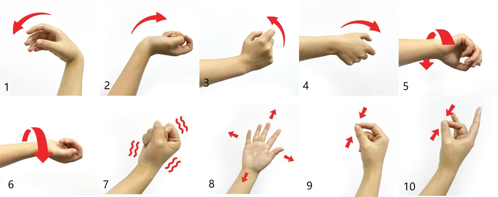

# hand_DT

This repository contains the public model release of our paper: "[Exploring pattern-specific components associated with hand gestures through different sEMG measures](https://link.springer.com/article/10.1186/s12984-024-01526-3)" and "[Understanding of task-specific and subject-specific components in surface EMG](https://www.worldscientific.com/doi/abs/10.1142/S0129065725500467)".


## 📖 Overview

Surface electromyography (sEMG)-based gesture recognition is widely used in human-machine interaction (HMI), prosthetic control, wearable interfaces, and rehabilitation systems. However, conventional gesture recognition models often suffer from **poor cross-subject generalization**, since sEMG signals contain strong **subject-specific variations** caused by differences in physiology, muscle contraction habits, and electrode placement.

This work proposes that sEMG signals consist of two disentangled components:

- **Pattern-specific components**  
  Shared across users and associated only with gesture patterns.

- **Subject-specific components**  
  Related to individual physiological characteristics and recording variations.

To separate these two components, we propose a **GAN-enhanced disentanglement framework** based on a multi-encoder autoencoder architecture. The extracted pattern-specific components are then used for generalized gesture recognition in cross-subject scenarios.

---

## ✨ Key Contributions

### 1. Pattern-Specific sEMG Disentanglement

We introduce a disentanglement framework that separates:

- gesture-related information
- subject-related information

from high-density sEMG signals using:

- dual encoders
- shared decoder
- adversarial discriminator (GAN)

This allows the system to learn gesture representations that are more invariant across users.


### 2. Physiological Interpretability

The extracted pattern-specific components are reconstructed into spatial heatmaps aligned with the electrode topology, enabling visualization of muscle activation patterns during gestures.

The resulting heatmaps show:

- similarity across subjects
- clear differences across gestures
- correspondence with forearm muscle activation regions

This provides neurophysiological interpretability for the learned representations.

---

## 🧠 Method Overview

### Network Architecture

The proposed framework consists of:

- Pattern-specific encoder (`Ep`)
- Subject-specific encoder (`Es`)
- Shared decoder (`D`)
- GAN discriminator

The training objective includes triplet loss, reconstruction loss, cross-reconstruction loss, and adversarial loss.

<p align="center">
  
</p>

---

## 📊 Dataset

Experiments were conducted on the open-source **Hyser HD-sEMG dataset**.

### Dataset Details

- 20 subjects
- 256-channel HD-sEMG
- 10 hand gestures
- 2048 Hz sampling rate
- 4 electrode arrays (8×8 each)
- dynamic gesture tasks only


### Selected Gestures

<p align="center">
  
</p>

---

## 🏆 Main Results

### Gesture Recognition Accuracy

| Input Measure | Best Accuracy |
|---|---|
| Raw Signal | 52.61% |
| sEMG Envelope | 67.52% |
| STFT | 79.41% |
| RMS | 74.41% |
| WL | 76.23% |
| All Time-Domain Features | 82.51% |
| STFT + Time-Domain Features | **84.30%** |


### Visualization Results

The reconstructed heatmaps demonstrate:

- compact and gesture-specific activation regions
- cross-subject consistency
- physiologically meaningful muscle activation localization

Compared with waveform inputs, STFT and time-domain features produce more discriminative and interpretable gesture patterns.

<p align="center">
  
</p>

---

## 🛖 Repository 
### Structure

- `step0_main_code.py`: train/test the disentanglement model and export latent `.npz` files.
- `data_module.py`: PyTorch Lightning data modules for subject/session splits.
- `models.py`: encoder, decoder, Lightning model, latent export, and classifier model definitions.
- `step1_test_classifier.py`: evaluate latent features with `knn`, `svm`, `rf`, `ann`, `cnn`, or `lstm`.
- `step2_confusion_array_plot.py`: plot reconstruction correlation heatmap.
- `step3_generate_latent_plot.py`: regenerate/plot latent reconstruction maps from saved models.
- `step4_Statistical_Analysis.py`: statistical comparison of classifier accuracy files.
- `run_pipeline.sh`: complete train, test, and classifier workflow.


### Installation

```bash
conda create -n hand_dt python=3.10
conda activate hand_dt
pip install -r requirements.txt
```

The original code targets `pytorch-lightning==1.9.4`. Install a CUDA-compatible PyTorch build for your machine if the default `pip install torch` is not suitable.


### Data Layout

Each preprocessed data folder should contain subject/session folders:

```text
DATA_ROOT/
  PR_v1_features_half_unslice_repair/
    subject01_session1/
      pr_feature_smooth_dynamic.mat
      label_dynamic.mat
    subject01_session2/
      pr_feature_smooth_dynamic.mat
      label_dynamic.mat
```

`settings.py` maps `--data_type` to these folder names. You can either pass `--data_root /path/to/DATA_ROOT` or bypass the mapping with `--data_dir /path/to/specific/preprocessed/folder`.


### Main Parameters

`step0_main_code.py`:

- `--root_dir`: output root for models, logs, plots, and latent features. Default: `./runs`.
- `--data_root`: root of preprocessed data folders. Default can be set with `HAND_DT_DATA_ROOT`.
- `--data_dir`: explicit data folder; overrides `--data_root`.
- `--trail_id`: experiment id used in output paths. The name is kept for compatibility with existing results.
- `--test_id`: test subject ids, e.g. `--test_id 1 5 9`.
- `--session_id`: session id used as the training session; the other session is used for testing by `DataModule_session`.
- `--data_type`: one of `resample171_data_half`, `smooth_rms_half`, `unslice_features_half`, `stft_half`, `StftFeature`.
- `--features`: feature indices for custom feature-set runs.
- `--decoder_type`: `vae` or `orig`.
- `--purpose`: `train`, `test`, `test_trainset`, or `test_allset`.
- `--accelerator`: `gpu`, `cpu`, or `auto`.
- `--devices`: device ids for Lightning, e.g. `--devices 0` or `--devices 0 1`.
- `--batch_size`, `--num_workers`, `--max_epochs`, `--lr`, `--weight_decay`: training hyperparameters.
- `--lamda1`, `--lamda2`: loss weights for triplet and cross-reconstruction terms.

`step1_test_classifier.py`:

- `--root_dir`: same output root used by `step0_main_code.py`.
- `--trial_id`: one or more trial ids. Multiple trials concatenate latent features.
- `--test_id`, `--session_id`: subjects and sessions to evaluate.
- `--purpose`: `p` for gesture/pattern latent `xp`, `s` for subject latent `xs`.
- `--methods`: classifier list, e.g. `--methods knn rf svm`.
- `--latent_dim`: flattened latent branch dimension. Default `512`.


### Run

Edit environment variables as needed, then run:

```bash
chmod +x run_pipeline.sh
ROOT_DIR=./runs \
DATA_ROOT=/nas/data_EMG/data_DT \
TRIAL_ID=5 \
DATA_TYPE=unslice_features_half \
TEST_IDS="1" \
SESSION_ID=1 \
DEVICE_IDS="0" \
./run_pipeline.sh
```

Equivalent manual commands:

```bash
python step0_main_code.py --root_dir ./runs --data_root /nas/data_EMG/data_DT --trail_id 5 --test_id 1 --session_id 1 --data_type unslice_features_half --purpose train --accelerator gpu --devices 0
python step0_main_code.py --root_dir ./runs --data_root /nas/data_EMG/data_DT --trail_id 5 --test_id 1 --session_id 1 --data_type unslice_features_half --purpose test --accelerator gpu --devices 0
python step1_test_classifier.py --root_dir ./runs --trial_id 5 --test_id 1 --session_id 1 --purpose p --methods knn
```

Outputs are written under `ROOT_DIR/models`, `ROOT_DIR/latent_features`, and `ROOT_DIR/outputs`.

---

## 📌 Citation

If you find this work useful, please cite:

```bibtex
@article{yuan2024exploring,
  title={Exploring pattern-specific components associated with hand gestures through different sEMG measures},
  author={Yuan, Yangyang and Liu, Jionghui and Dai, Chenyun and Liu, Xiao and Hu, Bo and Fan, Jiahao},
  journal={Journal of neuroengineering and rehabilitation},
  volume={21},
  number={1},
  pages={233},
  year={2024},
  publisher={Springer}
}

@article{yuan2025understanding,
  title={Understanding of task-specific and subject-specific components in surface EMG},
  author={Yuan, Yangyang and Liu, Jionghui and Jiang, Xinyu and Fan, Jiahao and Chou, Chih-Hong and Dai, Chenyun},
  journal={International Journal of Neural Systems},
  volume={35},
  number={09},
  pages={2550046},
  year={2025},
  publisher={World Scientific}
}
```

---

## 📬 Contact

For questions or collaborations, please contact:

- Yangyang Yuan — yyyuan25@sjtu.edu.cn